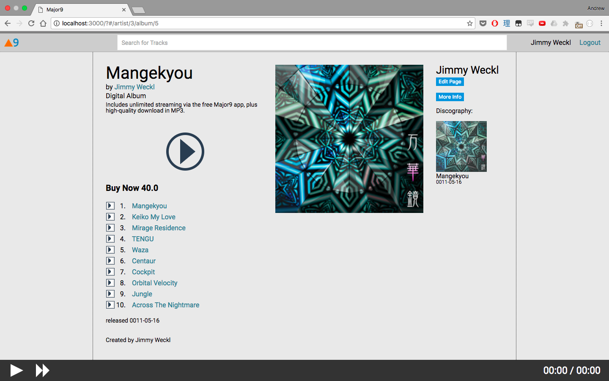
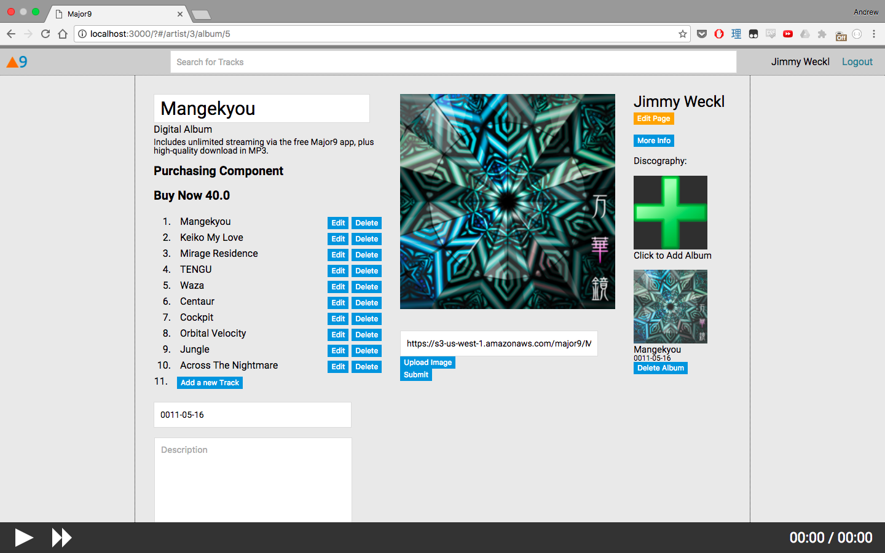
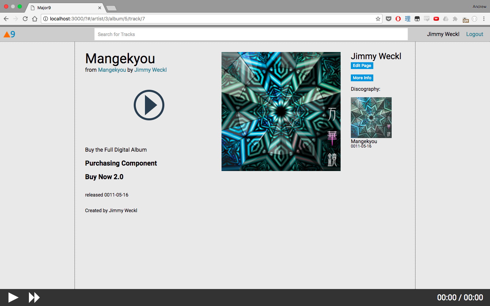
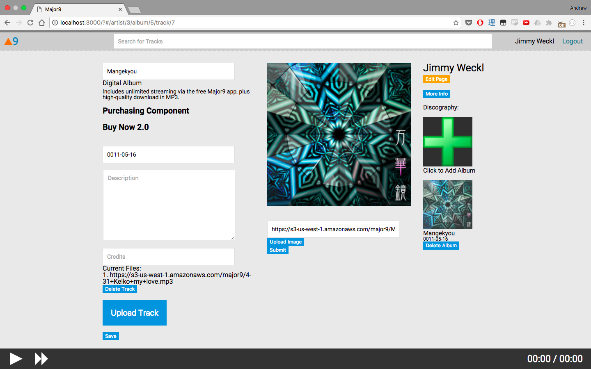
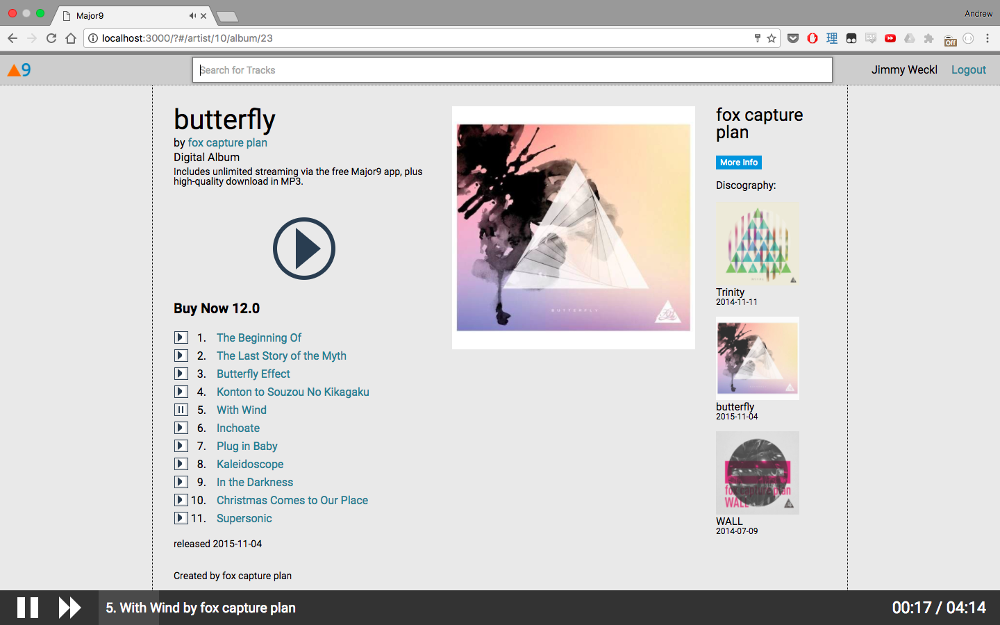
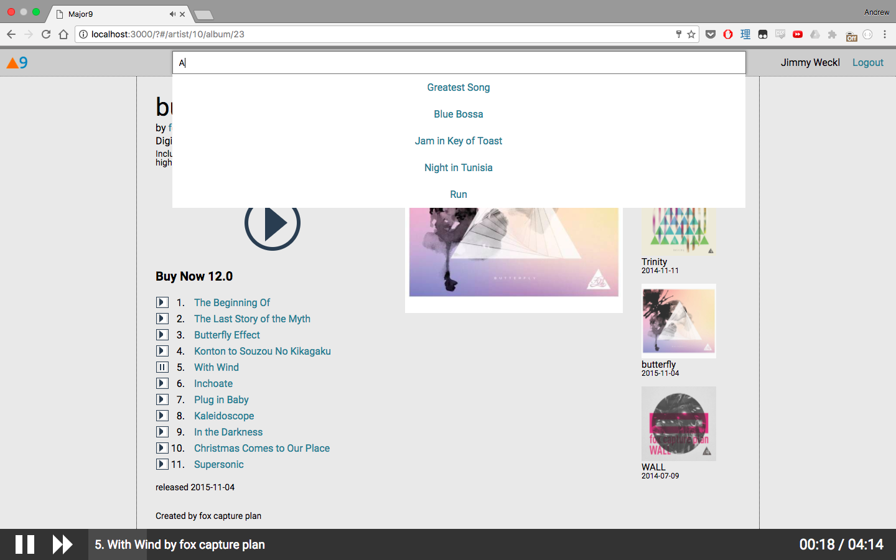

# Major9

[Major9 live][heroku]
[heroku]: http://major9.audio

Major9 is a full-stack web application clone of Bandcamp. The technologies used are Ruby on Rails for the backend, PostgreSQL for the database, and React-Redux for the front end.

##Purpose
I have been a long time user of bandcamp as both a fan and as an artist, so I felt I was qualified to attempt a replication the bandcamp site. Since it's creation however, other music playing apps have created features that add up to improved user experiences such as persisting music players and modernized user interfaces.

Although my goal was to clone bandcamp, I have implemented a few ideas from other competing products with the intent of creating a new tool that anyone can pick up intuitively.

## Features and Implementation

##Database
The database consists of 4 tables: users, tracks, albums, and files. The tracks and albums tables store all of the information and links needed to build the storefronts for every user.

The files database holds the url for every file needed to deliver the music to the user. The intent was to create multiple entries for every track in multiple audio formats so that the app can grow to support both users who require lossless audio and users who demand speed in content delivery.

## Tracks and Albums
Albums are the main attraction for the bandcamp experience. The art is rendered in a separate component from the textual information as they are generally shared between tracks if track art is unavailable. A sidebar is available to view the full discography of the artist at all times.

By storing album data inside the store, I was able to mimic a Twitter-style design mode concept for editing tracks. When logged in, the user is presented with an edit mode toggle button in the upper right hand corner of the screen. When clicked, the components render in an alternative mode where every field is editable. This serves as a modern alternative to loading seperate forms while also speeding up the process of music commerce without requiring multiple requests from the database.

In addition, track data is packaged along with album data through an association in the backend, allowing the user to continue to edit tracks directly from the album page with minimal interruptions. The user can upload tracks
through the show page through the cloudinary widget, which allows a callback wherein entries for the files table can be created on the fly.

## Download and Upload
The bulk of the seed data is being served from Amazon S3. However, I was unable to implement a download/upload service through Amazon. As such, non-seeded data is handled through Cloudinary.

The cloudinary widget allows a callback on successful upload that passes the information needed to create entries in the files backend. Images are also update in track and album data.

##Music Player
The current version of this site implements the react-responsive-audio-player. This package provides a simple interface that makes it easy to create song objects using the database I have provided for this web application.

However, due to the youth of the react community, this product is still in it's early stages. As such, the API was not very robust and required a bit of thought to control. In order to implement an autoplay on load, I had implemented a setTimeout that grabs the play/pause button using jQuery once the state components updated. This allowed synchronization of the album page play buttons and the playback of the player.

The song object requires a url and song information. As these were seperate databases, I once again used the albums database as a join table of sorts to bring the two elements together. This made it easier to pull information for the tracks out of the state and allowed easy playlist creation based on album track order.

##Search Bar
With having learned ES2015 as my first version of Javascript, documentation on many react-based search bars were filled with older syntax that I currently do not have the time to learn. In time I will pick up the older syntax. In the meanwhile, I decided to implement my own Search Bar using what I believe to be standard autosuggest implementation strategies.

Using an input form, I set an onChange listener to fire an AJAX request to the back end. Using a custom SQL query that searched tracks by album name, track name, and artist name, I limited the payload to the first 5 results.

With this dataset, I rendered an unordered list that was rearranged into a dropdown menu to allow for easier CSS styling. The result is a new set of search results on every keystroke.

In the future, I will improve the search results with a relevancy-ranked switch statement and fuzzy search.

###Future
As my first full web app, I still have many ideas I would like to experiment with. Here is a list of those features.

##Bonus Items
One of the coolest aspects of bandcamp is the ease of inclusion of bonus tracks and additional materials. Implementing a system that organizes these bonus items for distribution would be beneficial.

##Color Thief CSS styling
A cool concept from iTunes is the automatic creation of styling. I've wanted to explore this idea of using a tool like Color Thief to automatically style each band page based solely on the track art. I feel this would create an overall pleasing aesthetic for the web app.

##Song Discovery
This is implemented in bandcamp and most famously in Spotify, but I would like to explore the idea of song recommendations based on user habits and social trends.
